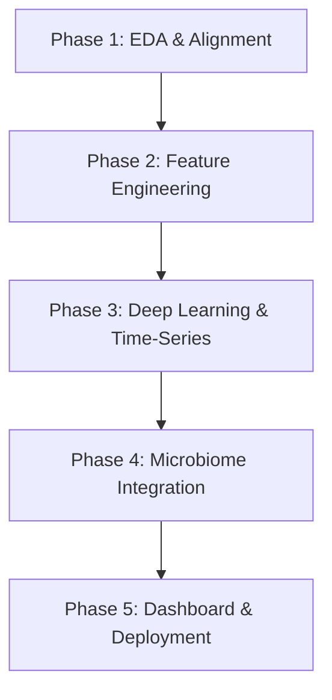

# Digital Twin for Type 2 Diabetes (T2D): Project Proposals & Roadmap

This document outlines the conceptual modules, data architectures, and implementation phases for building a Personalized Digital Twin for Type 2 Diabetes (T2D) utilizing the **CGMacros** dataset. 

---

## 1. Core Project Modules

### Module 1: Personalized Postprandial Glycemic Response (PPGR) Predictor
This module serves as the primary metabolic forecasting engine of the Digital Twin, predicting blood glucose excursions following food intake.
* **Goal:** Forecast peak glucose levels, time-to-peak, and Area Under the Curve (AUC) for the 2 to 4-hour window post-meal.
* **Inputs:**
  * **Dynamic Inputs:** Macronutrient content (carbohydrates, protein, fat, fiber), energy intake (calories), and the preceding 30-minute CGM trend.
  * **Static Baselines:** Demographics (age, sex, ethnicity), anthropometrics (BMI), and baseline lab markers (HbA1c, fasting insulin, lipids) from `bio.csv`.
* **Algorithms:** gradient-boosted decision trees (`XGBoost`, `CatBoost`, `LightGBM`) which perform exceptionally well on combined tabular baselines and dynamic meal inputs.

### Module 2: Gut Microbiome-Guided Personalization Engine
Standard predictors overlook how individual gut environments affect carbohydrate absorption and metabolic response.
* **Goal:** Personalize prediction models by integrating gut bacterial profiles.
* **Inputs:**
  * The 22 gut health scores (e.g., *Metabolic Fitness*, *Digestive Efficiency*) from `gut_health_test.csv` as categorical variables.
  * The presence/absence matrix of 1,979 gut bacteria in `microbs.csv` (requires dimensionality reduction via autoencoders, PCA, or UMAP).
* **Goal:** Quantify how varying gut microbiome compositions (e.g., high vs. low active microbial diversity) alter insulin sensitivity and glycemic curves for identical meal compositions.

### Module 3: Causal "What-If" Scenario Simulator
Allow users to interact with their virtual twin to simulate the outcome of behavioral adjustments before making them.
* **Goal:** Simulate counterfactual scenarios combining dietary choices and physical activity.
* **Scenarios to Model:**
  * **Meal Modifications:** "If I add 10g of fiber to this high-carb meal, how much is the peak glucose spike dampened?"
  * **Post-Meal Exercise:** "If I walk 3,000 steps (logged in Fitbit) 20 minutes after lunch, how will it affect my postprandial curve?"
* **Algorithms:** Causal inference models (`DoWhy` library, causal forests) and multi-input Seq2Seq or Temporal Fusion Transformers (TFT) to project continuous curves.

### Module 4: Computer Vision for Automated Dietary Logging
Eliminate manual food logging (a major barrier to patient compliance) by utilizing the pre- and post-meal photographs included in the dataset.
* **Goal:** Automate macronutrient and caloric estimation directly from photographs.
* **Tasks:**
  * **Food Detection & Classification:** Identify meal types and categories.
  * **Macronutrient Regression:** Use CNNs (e.g., `EfficientNet`, `ResNet`) or Vision Transformers (`ViT`) to estimate grams of carbohydrates, proteins, fats, and fiber from the "before" image.
  * **Portion Waste Estimation:** Compare "before" and "after" images to calculate actual food consumption and remaining residues.

### Module 5: Reinforcement Learning for Active Lifestyle Recommendations
Provide real-time, actionable coaching guidelines to keep patients in their target glucose range (70–180 mg/dL).
* **Goal:** Maximize Time in Range (TIR) through optimization loops.
* **Tasks:**
  * **Meal Composition Adjuster:** Recommend portion or ingredient changes (e.g., "Add 5g protein or swap with a higher-fiber alternative to avoid a yellow-zone spike").
  * **Activity Timing Optimizer:** Recommend precise walking schedules (e.g., "Walk for 15 minutes starting at 1:45 PM based on your predicted insulin response").

---

## 2. Project Implementation Roadmap

### Phase 1: Exploratory Data Analysis (EDA) & Alignment
* **Activities:** 
  * Clean and synchronize 1-minute CGM values with Fitbit step logs.
  * Parse meal timestamps and link them to the continuous time-series rows.
  * Implement dimensionality reduction on the 1,979 binary microbiome columns in `microbs.csv` down to dense embeddings.
* **Deliverables:** A clean, unified, and timestamp-aligned dataset.

### Phase 2: Feature Engineering & Baseline Predictors
* **Activities:** 
  * Define feature windows (e.g., 2-hour historical CGM trend, 30-minute cumulative steps).
  * Calculate postprandial metrics (peak glucose, time-to-peak, rate of change).
  * Build initial baseline regression models (Random Forest, XGBoost) to predict postprandial glucose levels using meal inputs.
* **Deliverables:** Baseline models and a standardized feature engineering pipeline.

### Phase 3: Time-Series Deep Learning Models
* **Activities:**
  * Train recurrent architectures (LSTMs, GRUs) or attention-based models (Transformers) to ingest historical time-series logs and forecast glucose 30, 60, and 120 minutes ahead.
  * Incorporate physical activity step counts as dynamic exogenous variables.
* **Deliverables:** High-frequency, multi-horizon glucose forecasting models.

### Phase 4: Personalization & Microbiome Integration
* **Activities:**
  * Combine the baseline models with static inputs (`bio.csv` data and microbiome embeddings).
  * Train multi-task models or conditional networks that adjust their weights based on the user's clinical baseline (HbA1c, fasting insulin) and gut health scores.
  * Conduct SHAP feature importance analysis to study the relative influence of the gut microbiome vs. clinical baselines.
* **Deliverables:** Fully personalized metabolic prediction engines.

### Phase 5: Dashboard Development & Deployment
* **Activities:**
  * Build a frontend interactive dashboard for simulations.
  * Add sliders for food components (Carbohydrates, Fiber, Protein) and activity logs (Steps, Duration).
  * Render real-time simulated glucose projections comparing different behaviors side-by-side.
* **Deliverables:** A functional, interactive user interface representing the operational Digital Twin.

---

## 3. Recommended Technical Stack

| Category | Tools & Libraries | Purpose |
| :--- | :--- | :--- |
| **Data Manipulation** | `pandas`, `numpy`, `scipy` | Data clearing, timestamp alignment, and statistical analysis. |
| **Microbiome Embeddings** | `scikit-learn` (PCA, UMAP), Autoencoders | Dimensionality reduction of the 1,979 gut bacteria columns. |
| **Machine Learning** | `xgboost`, `catboost`, `lightgbm` | Baseline predictors for postprandial peak estimations. |
| **Deep Learning** | `PyTorch` or `TensorFlow` | Recurrent neural networks (LSTMs/GRUs) and Vision models. |
| **Causal Inference** | `DoWhy`, `EconML` | Modeling the counterfactual impact of exercise and diet changes. |
| **UI / Dashboard** | `Streamlit` or `Gradio` | Interactive prototyping for the simulation interface. |
