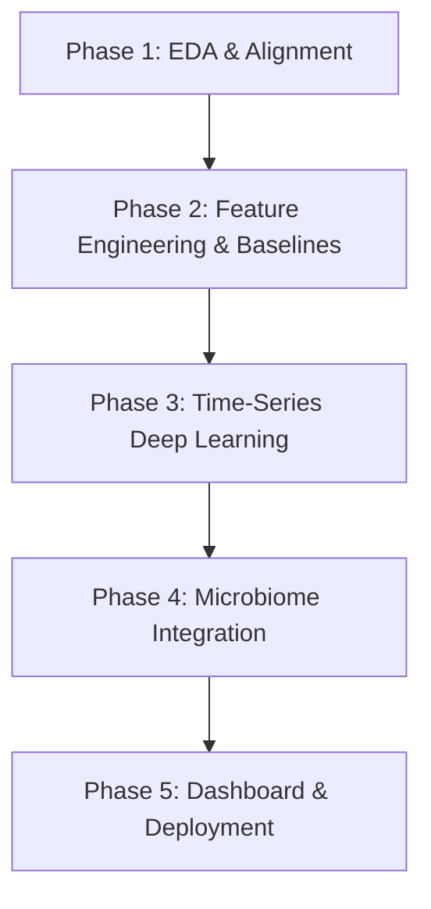

# Personalized Digital Twin for Type 2 Diabetes (T2D)

A data-driven **Digital Twin platform** for Type 2 Diabetes management and glycemic forecasting, built using the **CGMacros** dataset. This system integrates Continuous Glucose Monitoring (CGM) time-series data, physical activity logs, dietary macronutrient tracking, clinical metadata, and gut microbiome profiles to deliver real-time personalized glucose forecasting and causal "What-If" scenario simulations.

---

## 🚀 Key Modules

1. **Postprandial Glycemic Response (PPGR) Predictor**: Forecasts peak glucose levels, time-to-peak, and post-meal Area Under the Curve (AUC) for 2–4 hour windows using dynamic meal inputs and clinical baselines.
2. **Gut Microbiome-Guided Personalization Engine**: Integrates gut bacterial profiles (1,979 microbial features) and health scores to personalize glycemic predictions based on unique microbiome signatures.
3. **Causal "What-If" Scenario Simulator**: Models counterfactual scenarios for dietary adjustments (e.g., adding fiber) and physical activity (e.g., post-meal walking) using causal inference models.
4. **Automated Dietary Logging (Computer Vision)**: Leverages pre- and post-meal images for automated food classification, macronutrient estimation, and portion waste analysis.
5. **Reinforcement Learning Lifestyle Coach**: Provides real-time activity and nutritional recommendations to maximize Time in Range (TIR: 70–180 mg/dL).

---

## 🛠️ Tech Stack

* **Language & Runtime:** Python 3.10+
* **Data Processing:** `pandas`, `numpy`, `scipy`
* **Machine Learning:** `xgboost`, `catboost`, `lightgbm`, `scikit-learn`
* **Deep Learning:** `PyTorch` / `TensorFlow` (LSTMs, GRUs, Transformers, Vision models)
* **Microbiome Analysis:** Dimensionality reduction via `PCA`, `UMAP`, and Autoencoders
* **Causal Inference:** `DoWhy`, `EconML`
* **Dashboard / UI:** `Streamlit` / `Gradio`

---

## 📅 Project Roadmap



---

## 📁 Repository Structure

```
Digital-Twin-for-Diabetes/
├── Literature_Review_Major_Project.pdf   # Major project research review (PDF)
├── Literature_Review_Major_Project.tex   # LaTeX source for literature review
├── Project_Modules_and_Phases.md         # Detailed module design and project roadmap
├── .gitignore                             # Ignored files (virtual environments, cache, build artifacts)
└── README.md                             # Project documentation
```

---

## 💻 Getting Started

### 1. Prerequisites
- Python 3.10+
- Git

### 2. Setup Virtual Environment

```bash
# Clone the repository
git clone https://github.com/<YOUR-USERNAME>/Digital-Twin-for-Diabetes.git
cd Digital-Twin-for-Diabetes

# Create and activate virtual environment
python -m venv .venv

# On Windows (PowerShell):
.venv\Scripts\Activate.ps1

# On Linux/macOS:
source .venv/bin/activate
```

---

## 📝 License & References

This project is developed as part of the **Major Project for B.Tech Semester 7**. Data derived from the **CGMacros** study.
