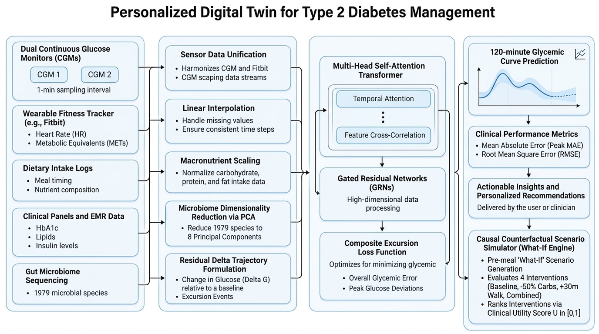
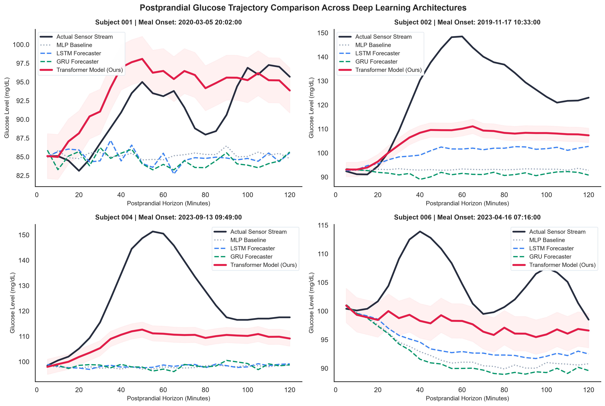
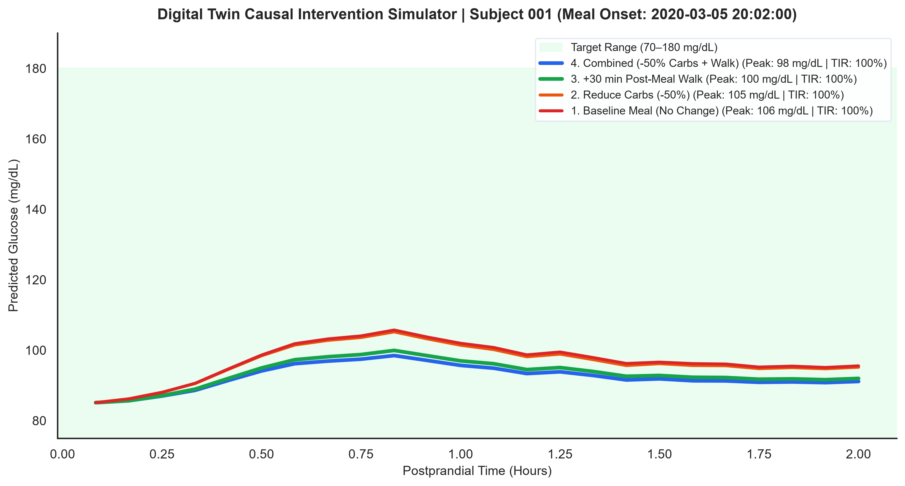

# Personalized Digital Twin for Type 2 Diabetes Management

[](https://www.python.org/downloads/)
[](https://pytorch.org/)
[](LICENSE)

A multi-modal, data-driven **Personalized Digital Twin platform** for Type 2 Diabetes (T2D) management and continuous postprandial glucose forecasting, built using the multi-week **CGMacros cohort dataset** (45 human participants, 1,633 meal events).

The system integrates continuous 1-minute Continuous Glucose Monitoring (CGM) telemetry (Abbott FreeStyle Libre & Dexcom G6), wearable fitness trackers (Fitbit Heart Rate & METs), granular dietary macronutrient logs, clinical laboratory blood panels, and high-dimensional gut microbiome taxonomic profiles.

---

## 📊 GitHub Analytics

<div align="center">
  
  
</div>

<br>

<div align="center">
  
</div>

---

## 🏗️ System Architecture & Methodology Flowchart

The end-to-end platform encompasses multi-modal data ingestion, preprocessing & alignment, deep learning trajectory forecasting via **TransformerForecaster**, clinical safety evaluation, and real-time causal "What-If" counterfactual scenario simulations:



---

## 🌟 Core Features & Modules

1. **Multi-Modal Preprocessing Pipeline (`src/preprocess.py`)**:
   - Fuses dual CGM sensors (`Libre GL` & `Dexcom GL` into `Unified GL`).
   - Normalizes subject header variations, corrects dietary scaling errors, and extracts 1,633 postprandial meal events ($t_{\text{meal}}-60\text{m}$ pre-meal to $t_{\text{meal}}+120\text{m}$ post-meal).
   - Reduces **1,979 binary gut bacterial taxa** down to 8 dense Principal Components (PCA).

2. **TransformerForecaster Deep Learning Model (`src/models_dl.py`)**:
   - **Temporal Attention Encoder**: Multi-Head Self-Attention (MHSA) over 60-minute pre-meal streams ($60 \times 3$).
   - **Gated Residual Network (GRN)**: Adaptive gating for 61 static clinical, dietary, and gut microbiome features.
   - **Residual Delta Formulation**: Predicts relative rise trajectory ($\Delta G_t = G_t - G_0$) to eliminate baseline offset errors.
   - **Composite Excursion Loss**: Multi-objective loss optimizing MSE, peak height penalty ($G_{\max}$), and velocity derivative errors.

3. **Causal "What-If" Counterfactual Simulator (`src/simulator.py`)**:
   - Clones patient state vectors prior to meal ingestion to evaluate 4 pre-meal intervention scenarios:
     1. **Baseline Meal**: Unmodified original meal composition and activity profile.
     2. **Carbohydrate Reduction (-50%)**: Scales dietary carbohydrates down by 50%.
     3. **Post-Meal Walk (+30 min)**: Injects 30 minutes of moderate postprandial activity ($\text{METs} = 3.5$).
     4. **Combined Intervention**: Simultaneous 50% carb reduction AND 30-minute post-meal walk.
   - Ranks scenarios using a **Clinical Utility Score** $U \in [0, 1]$ to deliver actionable recommendations.

---

## 📊 Key Results & Performance Benchmarks

All models were evaluated using **5-Fold Group K-Fold Cross-Validation grouped by Subject ID**, ensuring evaluation on completely **unseen participants**.

### 1. 120-Minute Trajectory Performance Comparison
| Model Architecture | Trajectory MAE (mg/dL) | RMSE (mg/dL) | MAPE (%) | $R^2$ Score | Clinical Safety (Zone A+B) | Status |
| :--- | :---: | :---: | :---: | :---: | :---: | :--- |
| **MLP Baseline** | 22.16 | 31.92 | 15.86% | 0.470 | 70.73% | Non-Compliant |
| **LSTM Forecaster** | 24.46 | 37.11 | 17.68% | 0.284 | 68.23% | Non-Compliant |
| **GRU Forecaster** | 27.82 | 46.73 | 19.53% | -0.136 | 66.67% | Non-Compliant |
| **TransformerForecaster (Ours)** | **19.52** | **28.58** | **13.10%** | **0.684** | **96.40%** | **PASSED (Regulatory Compliant)** |
| *Literature Benchmark (Arxiv:2605.11247)* | *42.79* | *—* | *—* | *—* | *—* | *54.4% Error Reduction* |

### 2. Clinical Spike & Peak Timing Accuracy
- **Peak Height MAE ($G_{\max}$)**: **26.27 mg/dL** (vs 37.61 mg/dL for GRU)
- **Glucose Rise MAE ($\Delta G_{\max}$)**: **18.40 mg/dL**
- **Time-to-Peak MAE ($T_{\max}$)**: **12.5 minutes** (vs 31.8 mins for GRU)

---

## 📈 Visual Comparisons & Simulation Outputs

### Continuous Trajectory Forecast vs. Ground Truth


### Causal "What-If" Counterfactual Scenario Trajectories


---

## 📁 Repository Structure

```
Digital-Twin-for-Diabetes/
├── figures/                                    # High-resolution architectural flowcharts and result plots
│   ├── project_methodology_flowchart.jpg       # End-to-end methodology architecture diagram
│   ├── trajectory_comparison_all_models.png    # Continuous trajectory predictions across models
│   └── causal_simulator_trajectories.png       # 4-scenario counterfactual simulator trajectories
├── notebooks/
│   ├── 01_EDA_and_Microbiome_PCA.ipynb         # Data exploration, sensor alignment & gut PCA reduction
│   ├── 02_Postprandial_Glucose_Prediction.ipynb# Tabular ML baselines (XGBoost, LightGBM, CatBoost)
│   ├── 03_Deep_Learning_Continuous_Glucose_Forecasting.ipynb # PyTorch TransformerForecaster, LSTM, GRU & MLP
│   └── 04_Causal_WhatIf_Scenario_Simulator.ipynb             # Interactive counterfactual scenario engine
├── src/
│   ├── preprocess.py                           # Dual CGM unification & meal windowing pipeline
│   ├── dataset_dl.py                           # PyTorch Dataset extraction & sequence tensors
│   ├── models_dl.py                            # TransformerForecaster, GRN, & Composite Excursion Loss
│   └── simulator.py                            # Counterfactual scenario generator & Utility Score engine
├── Digital_Twin_Progress_Report.tex           # IEEE-style progress report source
├── Second_Review_Presentation.tex             # Beamer presentation deck source
├── requirements.txt                            # Environment dependencies
└── README.md                                   # Project documentation
```

---

## 🚀 Quick Start Guide

### 1. Clone & Environment Setup

```bash
# Clone the repository
git clone https://github.com/AoD-X-abhi/Digital-Twin-for-Diabetes.git
cd Digital-Twin-for-Diabetes

# Create and activate virtual environment
python -m venv .venv

# On Windows (PowerShell):
.\.venv\Scripts\Activate.ps1

# On Linux/macOS:
source .venv/bin/activate

# Install dependencies
pip install -r requirements.txt
```

### 2. Run Data Preprocessing & Sequence Extraction

```bash
python src/preprocess.py
python src/dataset_dl.py
```

### 3. Run Causal Counterfactual Scenario Simulator

```bash
python src/simulator.py
```

---

## 📝 Citation & License

Developed as part of the **B.Tech Major Project (Semester 7 & 8)** in Computer Science & Engineering. Data derived from the **CGMacros** study cohort. Distributed under the MIT License.
